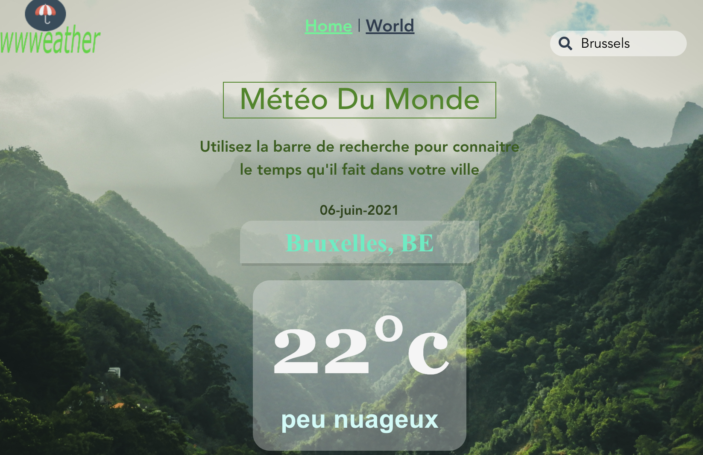

# WWWEATHER
  wwweather is an app created with Vue JS framework. It is based on Openweathermap API that helps us to know the weather around the world.
## Project setup
```
npm install
```

### Compiles and hot-reloads for development
```
npm run serve
```

### Compiles and minifies for production
```
npm run build
```

### Lints and fixes files
```
npm run lint
```

### Preview

[See it online](https://housseynou.github.io/vuejs-project/.)
